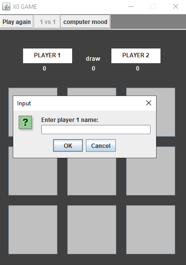
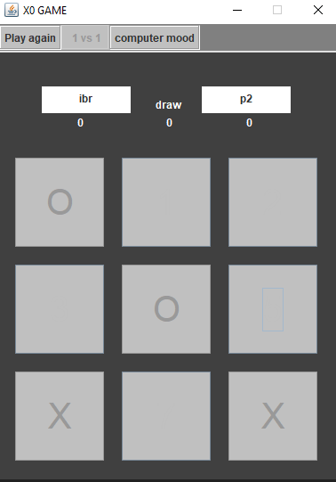

<h2>tic tac toe </h2>
I made tic tac toe with java swaing only, 
their are two mode for play,1.vs.1 and 1.vs.computer, 
it is so simpl project i hope you like it. 

How to run it 
after downlod the file go to:
Project_XO -> out -> artifacts -> untitled24_jar
you will find untitled24 clik on it and the game 
will start.

